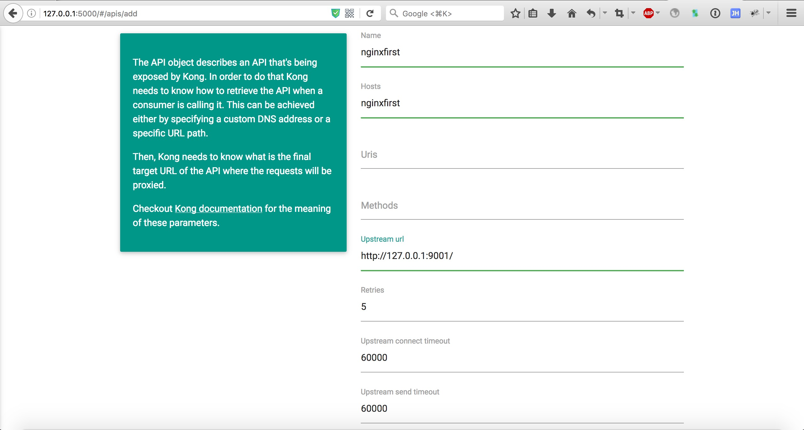
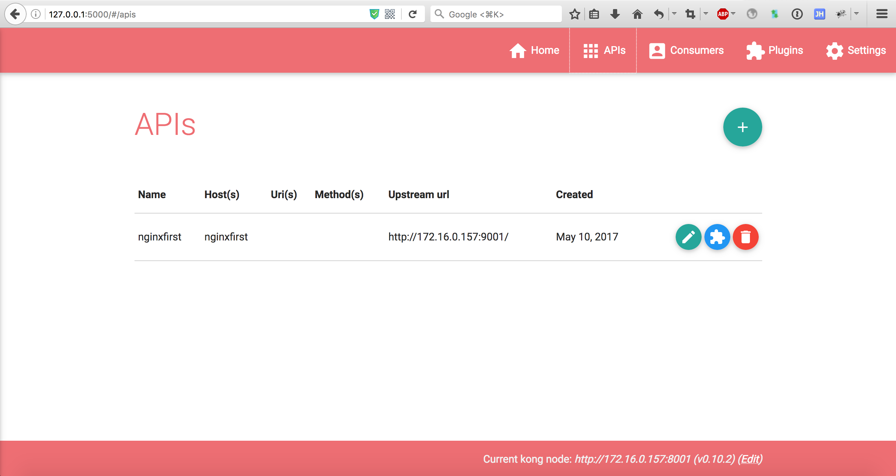
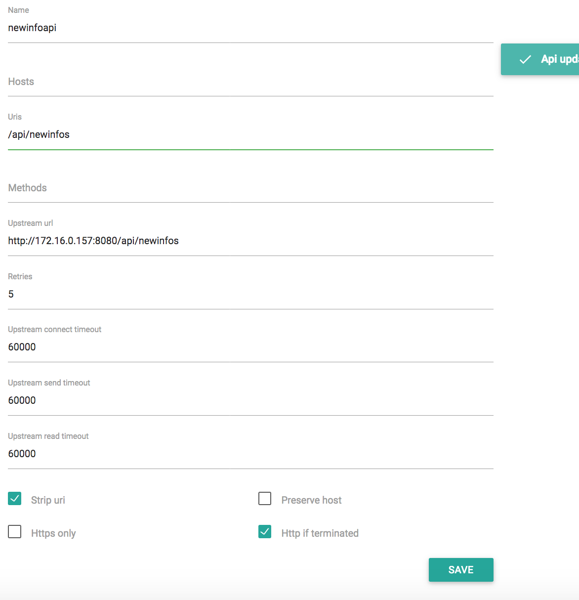
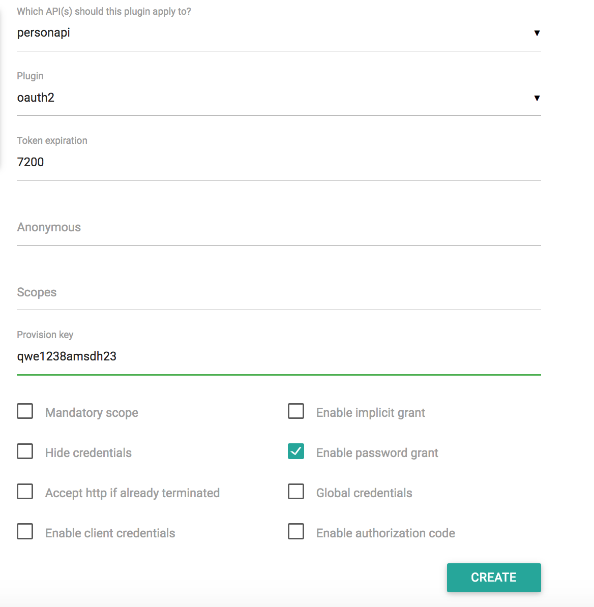
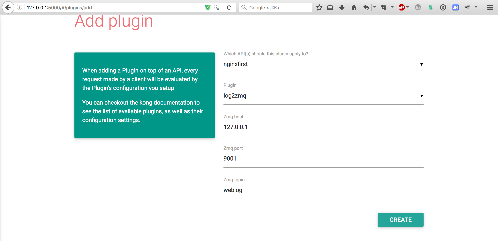
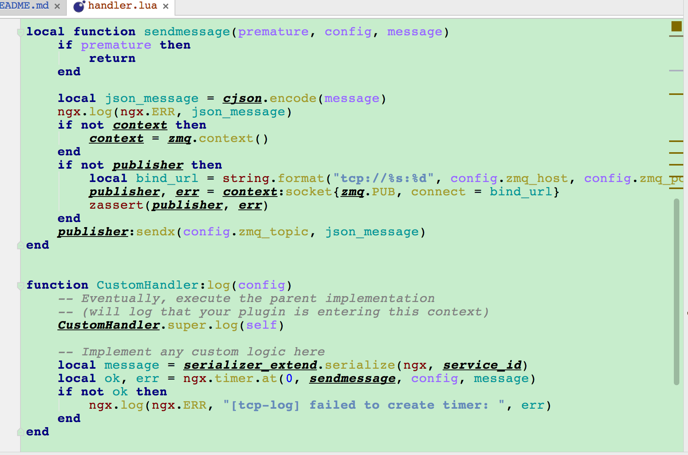

# [云框架]KONG API Gateway


[](CONTRIBUTORS.md)


当我们决定对应用进行微服务改造时，应用客户端如何与微服务交互的问题也随之而来，毕竟服务数量的增加会直接导致部署授权、负载均衡、通信管理、分析和改变的难度增加。

面对以上问题，API GATEWAY是一个不错的解决方案，其所提供的访问限制、安全、流量控制、分析监控、日志、请求转发、合成和协议转换功能，可以解放开发者去把精力集中在具体逻辑的代码，而不是把时间花费在考虑如何解决应用和其他微服务链接的问题上。

在众多API GATEWAY框架中，Mashape开源的高性能高可用API网关和API服务管理层——[KONG](https://getkong.org/)（基于NGINX）特点尤为突出，它可以通过插件扩展已有功能，这些插件（使用lua编写）在API请求响应循环的生命周期中被执行。于此同时，KONG本身提供包括HTTP基本认证、密钥认证、CORS、TCP、UDP、文件日志、API请求限流、请求转发及NGINX监控等基本功能。目前，Kong在Mashape管理了超过15,000个API，为200,000开发者提供了每月数十亿的请求支持。

本篇[云框架](ABOUT.md)将结合一个**数据查询应用**介绍KONG API GATEWAY及其最佳实践方法。

# 内容概览

* [快速部署](#快速部署)
* [框架说明-业务](#框架说明-业务)
* [框架说明-组件](#框架说明-组件)
   * [组件架构](#组件架构)
   * [KONG基本使用](#KONG基本使用)
   * [ROUTING实现](#ROUTING)
   * [AUTHENTICATION实现](#AUTHENTICATION)
   * [SECURITY实现](#SECURITY)
   * [TRAFFIC CONTROL实现](#TRAFFICCONTROL)
   * [LOGGING实现](#LOGGING)
* [KONG插件开发](#KONG插件开发)
   * [开发流程](#开发流程)
   * [开发示例1:log2zmq](#log2zmq)
   * [开发实例2:accesslimiting](#accesslimiting)
* [生产环境](#生产环境)
* [常见问题](#常见问题)
* [更新计划](#更新计划)
* [社群贡献](#社群贡献)

# <a name="快速部署"></a>快速部署

1. [准备Docker环境](https://github.com/cloudframeworks-apigateway/user-guide-apigateway/blob/master/READMORE/install%20docker.md)

2. 启动两个web站点用于测试

   ```
   docker pull nginx:alpine
   docker run -d -p 9001:80 nginx:alpine
   docker run -d -p 9002:80 nginx:alpine
   ```

3. 启动kong
   
   ```
   docker pull kong
   docker pull postgres
   docker run -d --name kong-database \
                 -p 5432:5432 \
                 -e "POSTGRES_USER=kong" \
                 -e "POSTGRES_DB=kong" \
                 postgres
   docker run -d --name kong \
                 --link kong-database:kong-database \
                 -e "KONG_DATABASE=postgres" \
                 -e "KONG_PG_HOST=kong-database" \
                 -p 8000:8000 \
                 -p 8443:8443 \
                 -p 8001:8001 \
                 -p 7946:7946 \
                 -p 7946:7946/udp \
                 kong
   ```
4. 启动kong-dashboard

   ```
   docker pull goodraincloudframeworks/docker-kong-dashboard
   docker run -d -p 5000:5000 goodraincloudframeworks/docker-kong-dashboard
   ```

5. 基于[docker-compose](https://docs.docker.com/compose/install/)运行如下命令

   ```
   docker-compose -f docker-compose.yml up -d
   ```

6. 访问路径

   http://127.0.0.1:8000 - kong url
   
   http://127.0.0.1:8001 - kong admin url
   
   https://127.0.0.1:8443 - kong https url
   
   http://127.0.0.1:5000 - kong dashboard ui
   
   http://127.0.0.1:9001 - nginx demo1 url
   
   http://127.0.0.1:9002 - nginx demo2 url

# <a name="框架说明-业务"></a>框架说明-业务

数据查询应用，顾名思义提供简单的数据查询服务，并对外提供两个端口：

* user：处理敏感数据，如限制访问

* newinfo：普通数据对所有人开发

对比以上两个端口，我们可以相对清楚的理解KONG及其插件的效果和配置方法。

本例数据查询应用业务架构比较简明，如下图所示：

<div align=center></div>

# <a name="框架说明-组件"></a>框架说明-组件

本例使用KONG本身实现ROUTING，并添加了[OAuth 2.0](https://getkong.org/plugins/oauth2-authentication/)（AUTHENTICATION实现）、[Rate Limiting](https://getkong.org/plugins/rate-limiting/)（TRAFFIC CONTROL实现）、[File](https://getkong.org/plugins/file-log/)（LOGGING实现)等3个插件。（[更多官方插件](https://getkong.org/plugins/)）

同时借助了**KONG DASHBOARD**来更方便的管理和配置。

<a name="组件架构"></a>组件架构如下图所示：

<div align=center></div>

* newinfo端口仅通过KONG实现与user端口的路由，其他插件未使用

* user端口使用了AUTHENTICATION、TRAFFIC CONTROL、LOGGING等3个插件

* 客户端先请求KONG服务器，并被代理到最终的API应用

* 插件在API响应循环的生命周期中被执行

* KONG代理方式包括：
      
   1. 应用通过携带HOST头部路由到对应的API应用
      
   2. 通过不同的uri路由到API应用
    
   （以上两种方式均为基于Openresty动态增加upstream以及对upstream的DNS resolver来实现）

## <a name="KONG基本使用"></a>KONG基本使用

### <a name="注册API"></a>注册API

使用Kong代理API，首先需要把API注册到Kong。
我们可以通过命令行进行添加:
```
curl -i -X POST \
      --url http://127.0.0.1:8001/apis/ \
      --data 'name=nginxfirst' \
      --data 'hosts=nginxfirst' \
      --data 'upstream_url=http://xx.xx.xx.xx:9001/'
```
可以从返回的数据判断注册是否成功。
也可以通过kong-dashboard(kong的ui管理界面)进行添加:

<div align=center></div>

创建成功后可以看到API的列表页查看

<div align=center></div>

上面我们将9001的nginx注册到Kong

### <a name="添加用户"></a>添加用户

对于API来讲，有可能没有用户概念，用户可以随意调用。
对于这种情况，Kong提供了一种consumer对象。
consumer是全局共用的，比如某个API启用了key-auth,那么没有身份的访问者就无法调用这个API了。
需要首先创建一个Consumer，然后在key-auth插件中为这个consumer生成一个key。
然后就可以使用这个key来透过权限验证访问API了。

如果另外一个API也开通了key-auth插件，那么这个consumer也是可以通过key-auth验证访问这个API的，如果要控制这种情况，就需要Kong的ACL插件。
一定要记住: 对于Kong来讲，认证与权限乃是两个不同的东西。

<div align=center></div>

### <a name="API添加插件"></a>API添加插件

Kong默认提供了31种[插件](#Kong插件)。
Kong的插件独立作用于每一个API，不同的API可以使用完全不同的插件。
有的API完全开放，不需要任何认证;
有的API会涉及敏感数据，权限控制需要非常严格;
有的API完全不在乎调用频次或者日志;
有的API则严格限制调用频次或者日志;

可以通过rest api、kong-dashboard添加api的插件。
```
curl -i -X POST \
  --url http://127.0.0.1:8001/apis/nginxfirst/plugins/ \
  --data 'name=key-auth'
```

<div align=center></div>

上面注册的9001nginx添加了访问控制，所有通过验证的请求可以访问9001nginx;
验证失败请求则无法访问9001nginx。


我们通过命令行可以访问验证:

```
curl -H 'Host: nginxfirst' -H 'TT: e9da671f5c5d44d5bfdca95585283979' http://127.0.0.1:8000
```

<div align=center></div>

```
curl -H 'Host: nginxfirst' http://127.0.0.1:8000
```

<div align=center></div>

## <a name="ROUTING"></a>ROUTING实现

首先将服务注册到Kong，外部访问统一走api gateway代理。

>可以通过admin api进行注册，这里使用dashboard处理。

>* 注册用户信息api

<div align=center></div>

>* 注册新闻通知api

<div align=center></div>

>注册后可以通过Kong代理访问用户信息、消息通知

<div align=center></div>

<div align=center></div>

>此时，可以将用户信息、新闻通知对外访问控制限制为只有Kong可以访问，外部请求全部通过Kong进行代理。

## <a name="AUTHENTICATION"></a>AUTHENTICATION实现

> 对于用户信息数据，我们不希望对外公开，限制访问的用户。在Kong的AUTHENTICATION类插件中多种，其中Oauth2认证是最为广泛的。
这里我们使用OAuth 2.0 Authentication插件。

>首先我们注册Oauth2插件。详细可以参见[配置说明](https://getkong.org/plugins/oauth2-authentication/#configuration)

<div align=center></div>

>其次添加Consumer，添加Consuer对应的credentials

<div align=center></div>

>对于新闻通知，数据不敏感，我们不关心谁在查询，则无需特殊配置。

## <a name="SECURITY"></a>SECURITY实现

>对于用户信息接口，我们希望控制其访问的地址，只有我们规定的IP地址可以访问。其他均不能访问该API。

>Kong提供的SECURITY类插件中有IP Restriction插件可以实现。

>首先给用户信息接口添加IP Restriction插件扩展，这里我们设置白名单，只有名单内的IP可以访问API。

<div align=center></div>

>对于正常访问，展示如下:

<div align=center></div>

>对于其他IP访问，展示如下:

<div align=center></div>

>对于新闻通知接口，无此要求则无需配置该插件。

## <a name="TRAFFICCONTROL"></a>TRAFFIC CONTROL实现

>对于用户信息接口，我们希望控制其访问频率，不是无限制的访问。

>Kong提供的TRAFFIC CONTROL类插件中有rate limiting，可以满足该要求。

>首先给用户信息接口添加rate limiting插件扩展，这里我们设置为1min中只能访问1次。

<div align=center></div>

>对于正常访问，展示如下:

<div align=center></div>

>对于超出次数的访问，展示如下:

<div align=center></div>

>对于新闻通知接口，无此要求则无需配置该插件。

## <a name="LOGGING"></a>LOGGING实现

>对于用户信息接口，我们希望获取每次访问的日志。
>Kong提供的LOGGING类插件中有几种都可以满足该要求，日志输出到tcp server、udp server、日志文件、系统日志等。
>这里我们使用file-log插件。

>首先给用户信息接口添加file-log插件，这里我们设置为日志文件路径设为:/tmp/file.log.

<div align=center></div>

>备注: 日志文件一定要有写权限

>添加日志插件后，每次访问，都会记录访问记录:

<div align=center></div>

>日志格式可以参考[Log Format](https://getkong.org/plugins/file-log/#log-format)

>对于新闻通知接口，无此要求则无需配置该插件。

# <a name="KONG插件开发"></a>KONG插件开发

## <a name="KONG开发流程"></a>KONG开发流程

1. git clone Kong到本地
    
   ```
   git clone git@github.com:Mashape/kong.git
   ```
     
2. 创建自定义插件目录
    
   ```
   cd ${KONG_DIR}
   cd kong
   mkdir custom_plugins
   ```
     
3. 新增插件
    
   ```
   cd ${KONG_DIR}
   cd kong
   mkdir custom_plugins
   cd custom_plugins
   mkdir xxx
   ```
     
4. 编辑插件的schema.lua、handler.lua, 根据实际情况完成插件逻辑（[lua教程](http://www.runoob.com/lua/lua-tutorial.html)）

5. 修改`${KONG_DIR}/templates/kong_defaults.lua`，配置custom_plugins=xxx

6. 执行luaracks make安装插件到本地进行测试
     
7. 制作kong镜像，并[快速部署](#快速部署)

## <a name="#log2zmq"></a>开发示例1:log2zmq

   log2zmq插件用于获取请求的日志并将日志数据发送到zeromq。

1. 确认插件助恶时所需参数信息

   * zeromq服务器IP地址
   
   * zeromq服务器端口
   
   * zeromq的topic

2. 在custom_plugins中创建log2zmq目录，添加schmea.lua，并添加对应的逻辑用于处理API注册

<div align=center></div>

<div align=center></div>

3. 处理请求处理过程中插件的逻辑，通过handler.lua脚本完成。

   handler.lua需要扩展Kong的BasePlugin，这个是Kong插件的基础类，所有的插件都需要继承BasePlugin。在BasePlugin中定义了请求处理的几个过程，自定义插件可以通过复写这些方法完成对应的逻辑。

   <div align=center></div>

   这个插件需要收集日志，因此复写log方法完成日志收集、发送。

   <div align=center></div>

4. 修改kong_default.lua的custom_plugins数据

   ```
   custom_plugins = log2zmq
   ```

5. 本地测试插件功能

   ```
   luarocks make
   ```

6. 制作KONG的镜像，将自定义的插件打包到镜像中，并[快速部署](#快速部署)自定义KONG

## <a name="#accesslimiting"></a>开发示例2:accesslimiting

accesslimiting插件用于定义过去`period`分钟内，每个ip限制访问`limit`次

1. 确认插件注册时需要的参数信息:

   * 时间间隔`period`
   
   * ip访问次数限制`limit`

2. 在custom_plugins中创建accesslimiting目录，添加schmea.lua，添加对应的逻辑用于处理API注册

<div align=center></div>

3. 处理请求处理过程中插件的逻辑，需要handler.lua脚本完成

   accesslimiting插件需要存储访问数据，因此这里演示使用数据库进行存储（推荐redis等nosql）。存储数据除了handler.lua外，还需要定义插件的数据结构、数据库访问方法，而Kong支持2种数据结构: cassandra\postgres，这里使用postgres。

   3.1 定义表结构，在插件目录下创建migrations/postgres.lua，完成插件的初始化和清理逻辑，如下所示:
   
   ```
   mkdir -p ${KONG_DIR}/custom_plugins/xxx/migrations
   touch postgres.lua
   return {
        {
            name = "xxxxxxxxx",
            up = [[
                CREATE TABLE IF NOT EXISTS ${TABLENAME}(
                    xx
                );
            ]],
            down = [[
                DROP TABLE ${TABLENAME};
            ]]
        }
    }
   ```

   3.2 完成数据的访问，并在插件目录下创建dao/postgres.lua

   <div align=center></div>
   
   3.3 本插件在请求访问前确认是访问，因此复写access方法完成访问校验

   <div align=center></div>

4. 之后修改kong_default.lua的custom_plugins数据:

   ```
   custom_plugins = log2zmq, accesslimit
   ```

5. 本地测试插件功能

   ```
   luarocks make
   ```

6. 制作KONG的镜像，将自定义的插件打包到镜像中，并[快速部署](#快速部署)自定义KONG

# <a name="#生产环境"></a>生产环境

`TODO`

# <a name="#常见问题"></a>常见问题

`TODO`

# <a name="#更新计划"></a>更新计划

* `组件` 增加SERVERLESS实现
* `组件` 增加ANALYTICS&MONITORING实现
* `组件` 增加TRANSFORMATIONS实现

# <a name="#社群贡献"></a>社群贡献

+ QQ群: 
+ [参与贡献](CONTRIBUTING.md)
+ [联系我们](mailto:info@goodrain.com)

-------

[云框架](ABOUT.md)系列主题，遵循[APACHE LICENSE 2.0](LICENSE.md)协议发布。
