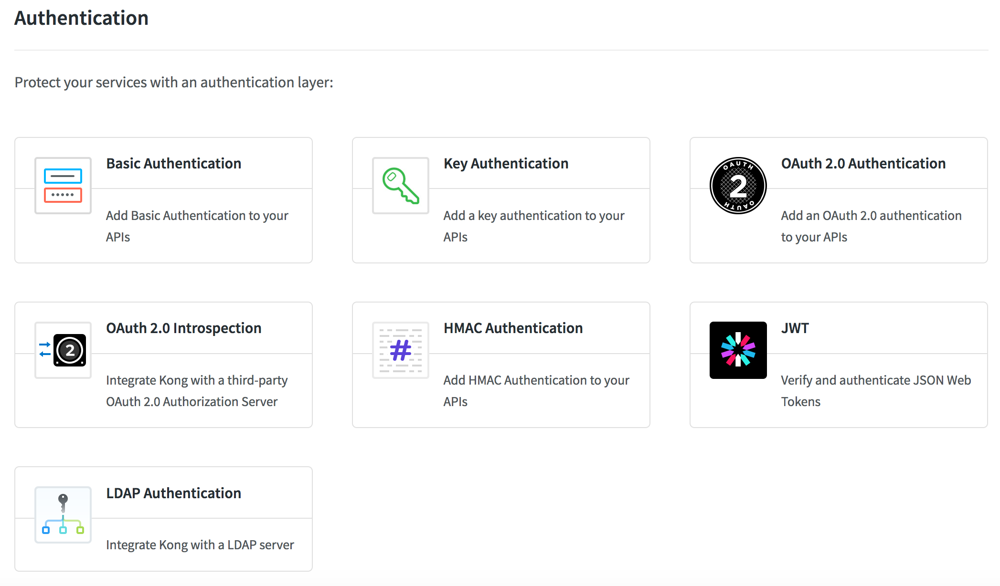
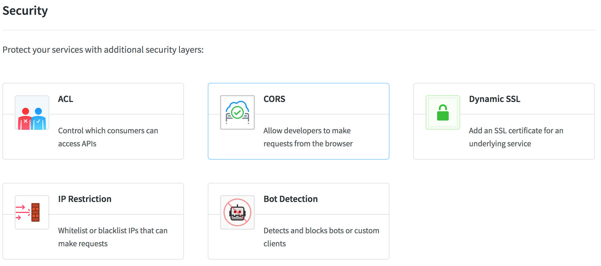
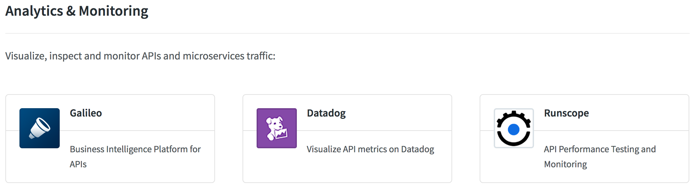

# [云框架]KONG API Gateway


[](CONTRIBUTORS.md)


随着微服务的流行，服务数量急剧增加，连接服务正在激增，部署授权、负载均衡、通信管理、分析和改变的难度也变得越来越大。api gateway可以提供访问限制、安全、流量控制、分析监控、日志、请求转发、合成和协议转换功能，api gateway可以让开发者集中精力去关心具体逻辑的代码，轻松地将应用和其他微服务连接起来，可以看作为准中间件或者服务导向架构媒介，api gateway允许企业打包自己的大型企业应用程序，并连接到网络服务上。

Api Gateway框架有很多，包括kong(Mashape开源)、microgateway(IBM开源)、Zuul、Amazon API网关、Tyk、APIAxle、apiGrove、janus(HelloFresh开源)等，其中[kong](https://getkong.org/)是基于nginx的网关实现，kong最诱人的一个特性是可以通过插件扩展已有功能，这些插件在API请求响应循环的生命周期中被执行。插件使用lua编写，而且kong还有如下几个基础功能：HTTP基本认证、密钥认证、CORS(Cross-origin Resource Sharing，跨域资源共享)、TCP、UDP、文件日志、API 请求限流、请求转发以及nginx监控。

本篇[云框架](ABOUT.md)主要介绍kong的实现原理，并结合小案例，为开发者提供基于kong的api gateway。

* 初学者可通过实例代码、文档快速学习kong及api gateway，并在社群中交流讨论；
* 已有一定了解的开发者，不必从零开始开发，仅需在云框架基础上替换部分业务代码，可自行添加kong插件。

# 内容概览

* [快速部署](#快速部署)
* [KONG说明](#KONG说明)
   * [KONG描述](#KONG描述)
   * [KONG插件](#KONG插件)
* [KONG使用](#KONG使用)
   * [注册API](#注册API)
   * [添加用户](#添加用户)
   * [API添加插件](#API添加插件)
* [KONG插件开发](#KONG插件开发)
   * [开发流程](#开发流程)
   * [log2zmq](#log2zmq)
   * [accesslimiting](#accesslimiting)
* [生产环境](#生产环境)
* [常见问题](#常见问题)
* [更新计划](#更新计划)
* [社群贡献](#社群贡献)

# <a name="快速部署">快速部署</a>

## <a name="镜像部署">镜像部署</a>

1. 准备Docker环境

2. 启动两个web站点用于测试

   ```
   docker pull nginx:alpine
   docker run -d -p 9001:80 nginx:alpine
   docker run -d -p 9002:80 nginx:alpine
   ```

3. 启动kong
   
   ```
   docker pull kong
   docker pull postgres
   docker run -d --name kong-database \
                 -p 5432:5432 \
                 -e "POSTGRES_USER=kong" \
                 -e "POSTGRES_DB=kong" \
                 postgres
   docker run -d --name kong \
                 --link kong-database:kong-database \
                 -e "KONG_DATABASE=postgres" \
                 -e "KONG_PG_HOST=kong-database" \
                 -p 8000:8000 \
                 -p 8443:8443 \
                 -p 8001:8001 \
                 -p 7946:7946 \
                 -p 7946:7946/udp \
                 kong
   ```
4. 启动kong-dashboard

   ```
   docker pull goodraincloudframeworks/docker-kong-dashboard
   docker run -d -p 5000:5000 goodraincloudframeworks/docker-kong-dashboard
   ```

5. 基于[docker-compose](https://docs.docker.com/compose/install/)运行如下命令

   ```
   docker-compose -f docker-compose.yml up -d
   ```

6. 访问路径

   http://127.0.0.1:8000 - kong url
   
   http://127.0.0.1:8001 - kong admin url
   
   https://127.0.0.1:8443 - kong https url
   
   http://127.0.0.1:5000 - kong dashboard ui
   
   http://127.0.0.1:9001 - nginx demo1 url
   
   http://127.0.0.1:9002 - nginx demo2 url

# <a name="KONG说明">KONG说明</a>

## <a name="KONG描述">KONG描述</a>

Kong是Mashape开源的高性能高可用API网关和API服务管理层。它基于OpenResty，进行API管理，并提供了插件实现API的AOP。
Kong在Mashape管理了超过15,000个API，为200,000开发者提供了每月数十亿的请求支持。非常稳定、高效。
首先我们先了解下Kong这个系统，如下图所示:


Kong在运行过程中，客户端请求将先请求Kong服务器，然后它会被代理到最终的API应用。而插件在api响应循环的生命周期中被执行。
Kong的代理方式有两种: 
* 应用通过携带Host头部路由到对应的API应用
* 通过不同的uri路由到API应用
这两种方式都是都是基于Openresty动态增加upstream以及对upstream的DNS resolver来实现。
插件的各个执行周期则是lua在nginx的各个周期对应。

传统的API结构与Kong API结构对比:


## <a name="KONG插件">KONG插件</a>

Kong默认提供了7类共31种插件(v0.10.2):
* Authentication

* Security

* Traffic Control

* Serverless

* Analytics & Monitoring

* Transformations

* Logging


这些插件可以满足大多数的需求，对于无法满足的业务需求，Kong提供扩展功能，用户可以自定义Kong插件。
后面以2个插件为例来说明Kong的扩展插件步骤。

# <a name="KONG使用">KONG使用</a>

Kong对外提供rest api进行管理。详见[Kong admin api](https://getkong.org/docs/0.10.x/admin-api/)

## <a name="注册API">注册API</a>

使用Kong代理API，首先需要把API注册到Kong。
我们可以通过命令行进行添加:
```
curl -i -X POST \
      --url http://127.0.0.1:8001/apis/ \
      --data 'name=nginxfirst' \
      --data 'hosts=nginxfirst' \
      --data 'upstream_url=http://xx.xx.xx.xx:9001/'
```
可以从返回的数据判断注册是否成功。
也可以通过kong-dashboard(kong的ui管理界面)进行添加:


创建成功后可以看到API的列表页查看


上面我们将9001的nginx注册到Kong

## <a name="添加用户">添加用户</a>

对于API来讲，有可能没有用户概念，用户可以随意调用。
对于这种情况，Kong提供了一种consumer对象。
consumer是全局共用的，比如某个API启用了key-auth,那么没有身份的访问者就无法调用这个API了。
需要首先创建一个Consumer，然后在key-auth插件中为这个consumer生成一个key。
然后就可以使用这个key来透过权限验证访问API了。

如果另外一个API也开通了key-auth插件，那么这个consumer也是可以通过key-auth验证访问这个API的，如果要控制这种情况，就需要Kong的ACL插件。
一定要记住: 对于Kong来讲，认证与权限乃是两个不同的东西。


## <a name="API添加插件">API添加插件</a>

Kong默认提供了31种[插件](#Kong插件)。
Kong的插件独立作用于每一个API，不同的API可以使用完全不同的插件。
有的API完全开放，不需要任何认证;
有的API会涉及敏感数据，权限控制需要非常严格;
有的API完全不在乎调用频次或者日志;
有的API则严格限制调用频次或者日志;

可以通过rest api、kong-dashboard添加api的插件。
```
curl -i -X POST \
  --url http://127.0.0.1:8001/apis/nginxfirst/plugins/ \
  --data 'name=key-auth'
```


上面注册的9001nginx添加了访问控制，所有通过验证的请求可以访问9001nginx;
验证失败请求则无法访问9001nginx。


我们通过命令行可以访问验证:
```
curl -H 'Host: nginxfirst' -H 'TT: e9da671f5c5d44d5bfdca95585283979' http://127.0.0.1:8000
```

```
curl -H 'Host: nginxfirst' http://127.0.0.1:8000
```


# <a name="KONG插件开发">KONG插件开发</a>

## <a name="开发流程">开发流程</a>

1. git clone Kong到本地
    ```
    git clone git@github.com:Mashape/kong.git
    ```
     
2. 创建自定义插件目录
    ```
    cd ${KONG_DIR}
    cd kong
    mkdir custom_plugins
    ```
     
3. 新增插件
    ```
    cd ${KONG_DIR}
    cd kong
    mkdir custom_plugins
    cd custom_plugins
    mkdir xxx
    ```
     
4. 编辑插件的schema.lua、handler.lua, 根据实际情况完成插件逻辑

5. 修改${KONG_DIR}/templates/kong_defaults.lua，配置custom_plugins=xxx

6. 执行luaracks make安装插件到本地进行测试
     
7. 制作kong镜像，之后参照[快速部署](#快速部署)，修改镜像名称，部署kong


## <a name="log2zmq">log2zmq</a>

### 插件描述
>这个插件的功能：
>* 获取请求的日志
>* 将日志数据发送到zeromq服务端

>首先确认插件注册时需要的参数信息:
>* zeromq的服务器IP地址
>* zeromq的服务器端口
>* zeromq的topic

>之后在custom_plugins中创建log2zmq目录，添加schmea.lua，添加对应的逻辑用于处理API注册。
>
>
>
>

>之后需要处理请求处理过程中插件的逻辑，需要handler.lua脚本完成。
handler.lua需要扩展Kong的BasePlugin，这个是Kong插件的基础类，所有的插件都需要继承BasePlugin。
在BasePlugin中定义了请求处理的几个过程，自定义插件可以通过复写这些方法完成对应的逻辑。
>
>

>这个插件需要收集日志，因此复写log方法完成日志收集、发送。
>
>

>之后修改kong_default.lua的custom_plugins数据:
>```
>custom_plugins = log2zmq
>```

>本地测试插件功能
>```
>luarocks make
>```

>制作kong的镜像，将自定义的插件打包到镜像中
>参照快速部署部署自定义kong


## <a name="accesslimiting">accesslimiting</a>
### 插件描述
>这个插件的功能：
>* 过去period分钟内，每个ip限制访问limit次

>首先确认插件注册时需要的参数信息:
>* period，时间间隔
>* limit，ip访问次数限制


>之后在custom_plugins中创建accesslimiting目录，添加schmea.lua，添加对应的逻辑用于处理API注册。
>
>

>之后需要处理请求处理过程中插件的逻辑，需要handler.lua脚本完成。
>这个插件需要存储访问数据，这里演示使用数据库进行存储，使用推荐redis等nosql。
>存储数据除了handler.lua外，还需要定义插件的数据结构、数据库访问方法。
>Kong支持2种数据结构: cassandra\postgres。这里使用postgres
>首先定义表结构，在插件目录下创建migrations/postgres.lua，完成插件的初始化和清理逻辑，如下所示:
>```
>mkdir -p ${KONG_DIR}/custom_plugins/xxx/migrations
>touch postgres.lua
>return {
>     {
>         name = "xxxxxxxxx",
>         up = [[
>             CREATE TABLE IF NOT EXISTS ${TABLENAME}(
>                 xx
>             );
>         ]],
>         down = [[
>             DROP TABLE ${TABLENAME};
>         ]]
>     }
> }
>```

>之后完成数据的访问，在插件目录下创建dao/postgres.lua
>


>这个插件在请求访问前确认是访问，因此复写access方法完成访问校验。
>

>之后修改kong_default.lua的custom_plugins数据:
>```
>custom_plugins = log2zmq, accesslimit
>```

>本地测试插件功能
>```
>luarocks make
>```

>制作kong的镜像，将自定义的插件打包到镜像中
>参照快速部署部署自定义kong

     
# <a name="生产环境"></a>生产环境

* `TODO` CI/CD
* `TODO` 扩容
* `TODO` 服务容错
* `TODO` 业务监控／性能分析
* `TODO` K8s部署

# <a name="常见问题"></a>常见问题

任何相关问题均可通过[GitHub ISSUE](https://github.com/cloudframeworks-springcloud/user-guide/issues)提交或讨论，问题总结请查看[[QA](QA.md)]

# <a name="更新计划"></a>更新计划

* `文档` 增加
* `组件` 增加
* `生产环境` 增加
* `快速部署` 增加
* `常见问题` 问题

点击查看[历史更新](CHANGELOG.md)

# <a name="社群贡献"></a>社群贡献

+ QQ群: 
+ [参与贡献](CONTRIBUTING.md)
+ [联系我们](mailto:info@goodrain.com)

-------

[云框架](ABOUT.md)系列主题，遵循[APACHE LICENSE 2.0](LICENSE.md)协议发布。
