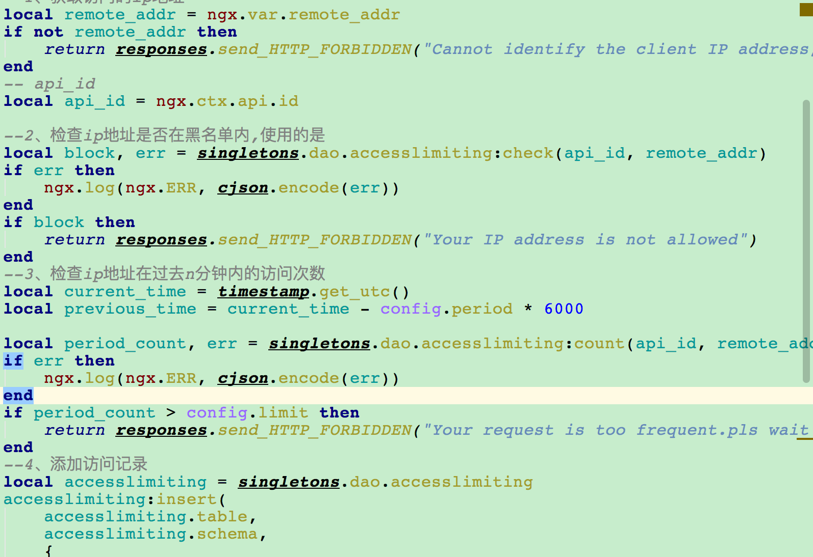

# KONG插件开发示例：accesslimiting

accesslimiting插件用于定义过去`period`分钟内，每个ip限制访问`limit`次

1. 确认插件注册时需要的参数信息:

   * 时间间隔`period`
   
   * ip访问次数限制`limit`

2. 在custom_plugins中创建accesslimiting目录，添加schmea.lua，添加对应的逻辑用于处理API注册

   <div align=center></div>

3. 处理请求处理过程中插件的逻辑，需要handler.lua脚本完成

   accesslimiting插件需要存储访问数据，因此这里演示使用数据库进行存储（推荐redis等nosql）。存储数据除了handler.lua外，还需要定义插件的数据结构、数据库访问方法，而Kong支持2种数据结构: cassandra\postgres，这里使用postgres。

   3.1 定义表结构，在插件目录下创建migrations/postgres.lua，完成插件的初始化和清理逻辑，如下所示:
   
   ```
   mkdir -p ${KONG_DIR}/custom_plugins/xxx/migrations
   touch postgres.lua
   return {
        {
            name = "xxxxxxxxx",
            up = [[
                CREATE TABLE IF NOT EXISTS ${TABLENAME}(
                    xx
                );
            ]],
            down = [[
                DROP TABLE ${TABLENAME};
            ]]
        }
    }
   ```

   3.2 完成数据的访问，并在插件目录下创建dao/postgres.lua

   <div align=center></div>
   
   3.3 本插件在请求访问前确认是访问，因此复写access方法完成访问校验

   <div align=center></div>

4. 之后修改kong_default.lua的custom_plugins数据:

   ```
   custom_plugins = log2zmq, accesslimit
   ```

5. 本地测试插件功能

   ```
   luarocks make
   ```

6. 制作KONG的镜像，将自定义的插件打包到镜像中，并[快速部署](#快速部署)自定义KONG
