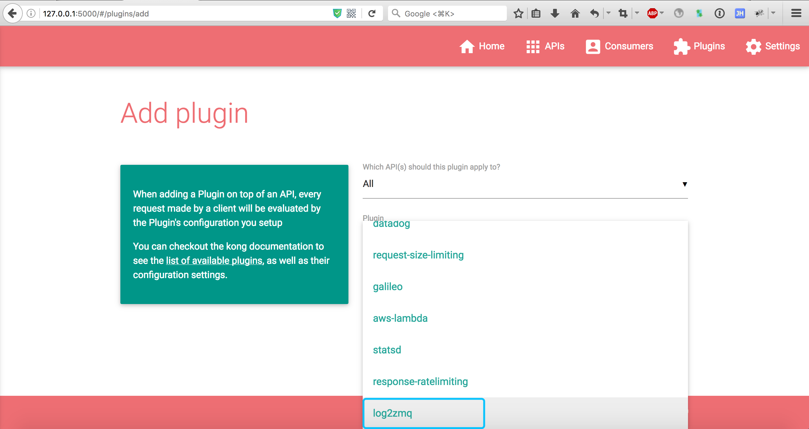
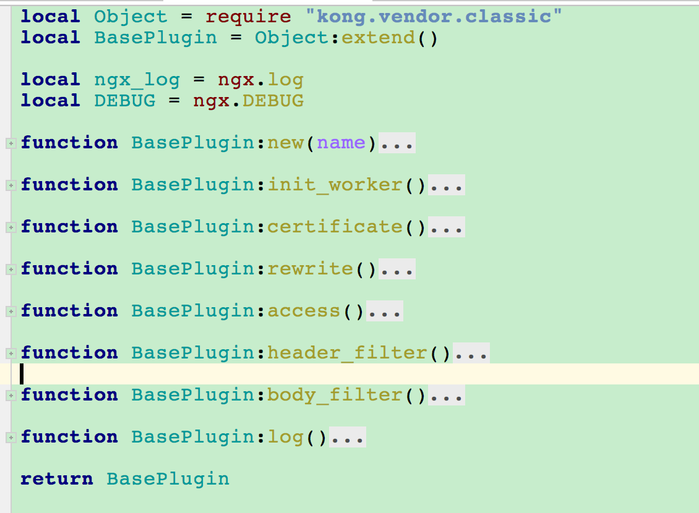

# KONG插件开发示例：log2zmq

log2zmq插件用于获取请求的日志并将日志数据发送到zeromq。

1. 确认插件助恶时所需参数信息

   * zeromq服务器IP地址
   
   * zeromq服务器端口
   
   * zeromq的topic

2. 在custom_plugins中创建log2zmq目录，添加schmea.lua，并添加对应的逻辑用于处理API注册

<div align=center></div>

<div align=center></div>

3. 处理请求处理过程中插件的逻辑，通过handler.lua脚本完成。

   handler.lua需要扩展Kong的BasePlugin，这个是Kong插件的基础类，所有的插件都需要继承BasePlugin。在BasePlugin中定义了请求处理的几个过程，自定义插件可以通过复写这些方法完成对应的逻辑。

<div align=center></div>

   这个插件需要收集日志，因此复写log方法完成日志收集、发送。

<div align=center></div>

4. 修改kong_default.lua的custom_plugins数据

   ```
   custom_plugins = log2zmq
   ```

5. 本地测试插件功能

   ```
   luarocks make
   ```

6. 制作KONG的镜像，将自定义的插件打包到镜像中，并[快速部署](#快速部署)自定义KONG
