# KONG DASHBOARD方法

KONG代理方式包括：1）应用通过携带HOST头部路由到对应的API应用；2）通过不同的uri路由到API应用

这里采用前者，因此通过DASHBOARD管理配置KONG，新增API或使用API可以为浏览器安装Modify Header插件以便访问。

如访问personapi（即实例中user端口），插件参数设置为：

* name：HOST

* value：personapi

## KONG基本使用

### 首次使用

首次访问 http://127.0.0.1:5000 ，将出现Kong node configuration页面。

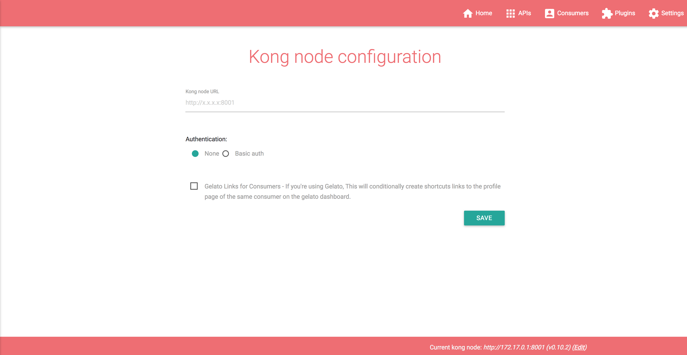

需要我们填写Kong node URL，注意此处应填写 http://172.17.0.1:8001 （docker0 interface ip）或 http://192.168.x.x:8001 (LAN ip) ，否则将显示`can't connect to Kong server`。AUTHENTICATION及Gelato links for consumer选项一般情况下无需配置。

成功后即可进入欢迎页面：

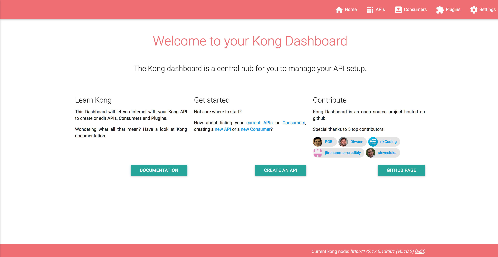

### 注册API

点击欢迎页面右上角`API`，并在页面中点击`ADD API`，进入API注册页面：

例如我们想要将user端口注册到kong，只需填写`Name`、`Hosts`、`Upstream uri`三项并点击`CREATE`即可，其他选项无需特意配置或使用默认即可。

添加后可在API页面查看已注册API：

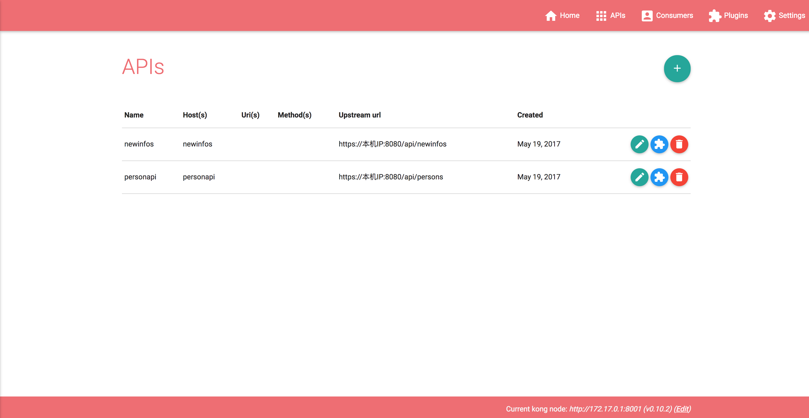

### 添加用户

点击欢迎页面右上角`Consumers`，并在页面中点击`ADD CONSUMER`，进入用户添加页面填写`Username`及`Custom id`并点击`CREATE`即可完成添加

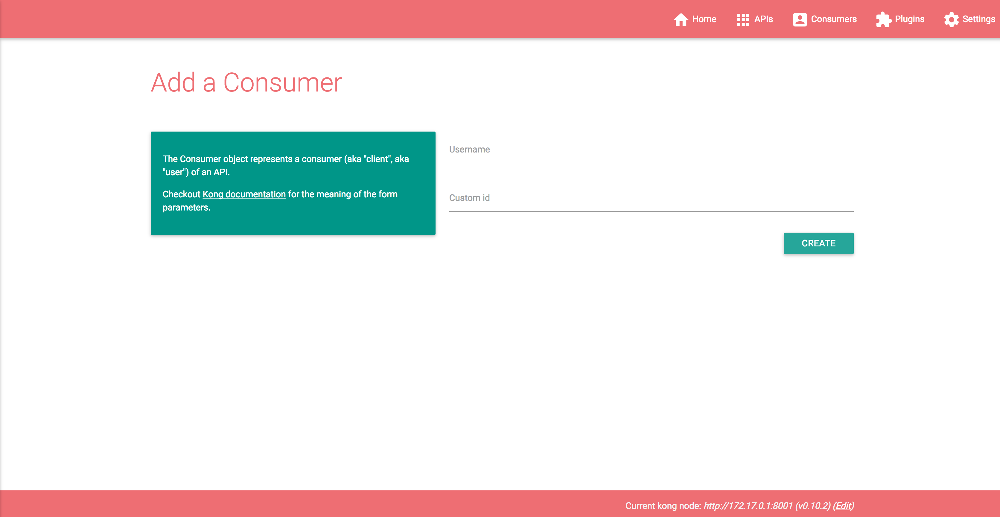

我们可以在consumer列表中管理用户，并为用户添加KEY AUTH（可以自己定义key或不填写使用kong自动生成的key）

### API添加插件

点击欢迎页面右上角`Plugins`，并在页面中点击`ADD PLUGIN`进入API添加插件页面，只需在下拉菜单中选择api及插件，并按照喜好定义key name、Anonymous及credentials是否隐藏即可。

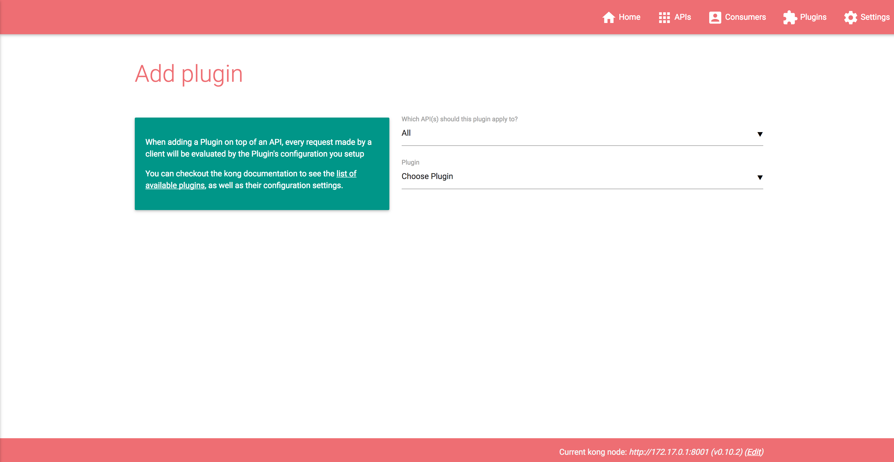

已添加插件可在Plugins列表中查看并随时修改。

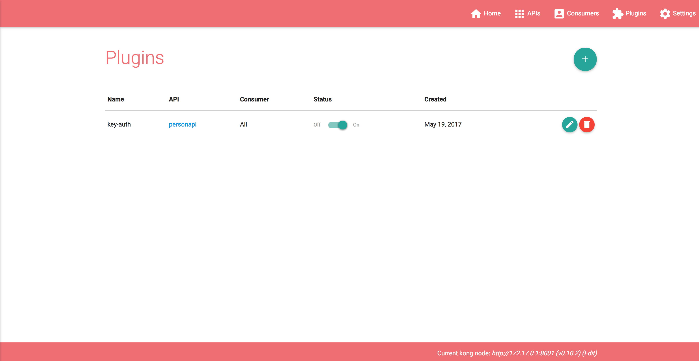

## ROUTING实现

**注册user端口api**

Name：personapi

Hosts：personapi

Upstream url：https://本机IP:8080/api/persons

**注册newinfo端口api**

Name：newinfoapi

Hosts：newinfoapi

Upstream url：https://本机IP:8080/api/newinfos

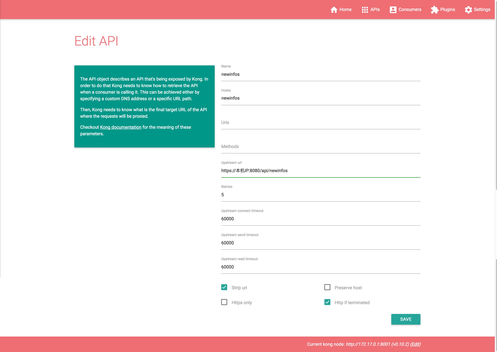

**通过Kong代理访问**

user端口：https://127.0.0.1:8080/api/persons

newinfo端口：https://127.0.0.1:8080/api/newinfos

## AUTHENTICATION实现

**user端口添加Oauth2插件**

API：personapi

Plugin：oauth2

Provision key：PASSWORD （按需填写）

勾选：Enable password grant （按需选择）

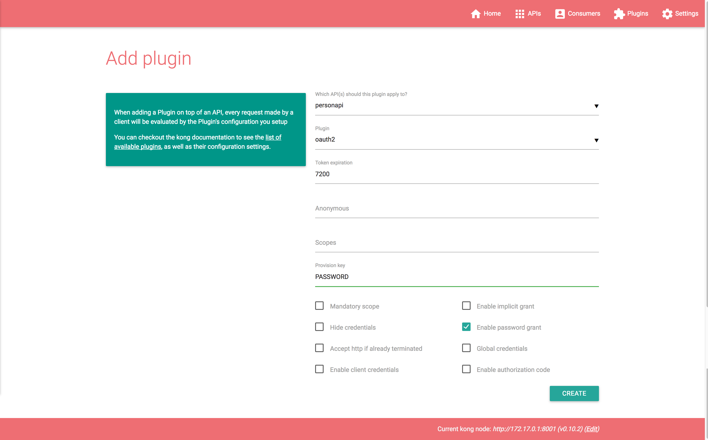

**添加Consumer**

Username：oauthadmin

Custom id：personapi

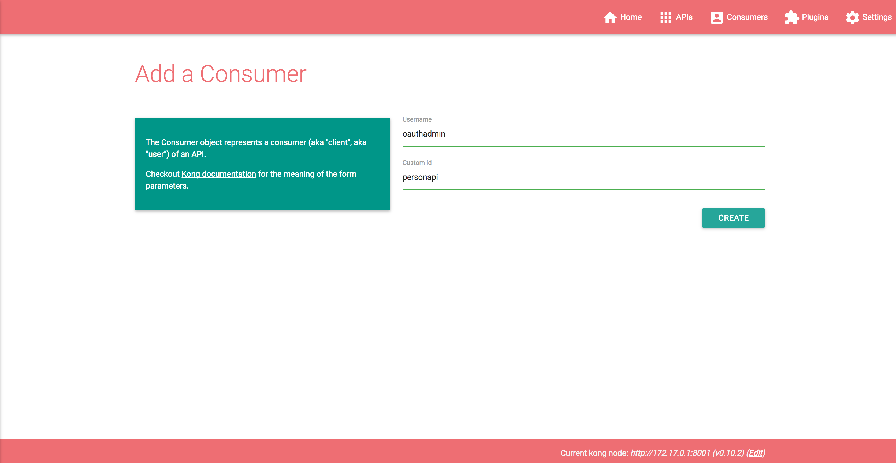

**添加对应Credentials**

Username：oauthadmin

Redirecting url：https://本机IP:8080/api/persons

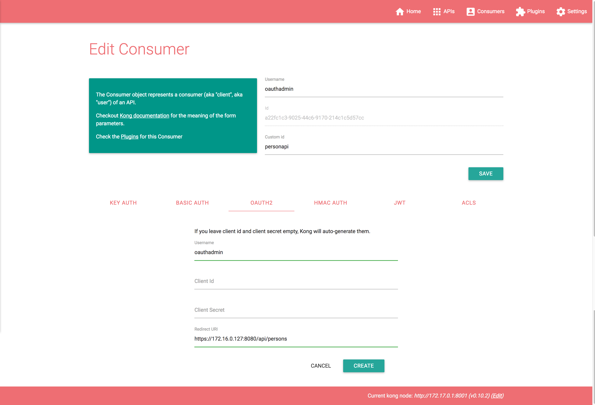

## SECURITY实现

**user端口添加IP Restriction插件扩展，并设置白名单**

API：personapi

Plugin：ip-restriction

Apply to：All Consumers

Whitelist：172.17.0.1 （可按需要修改）

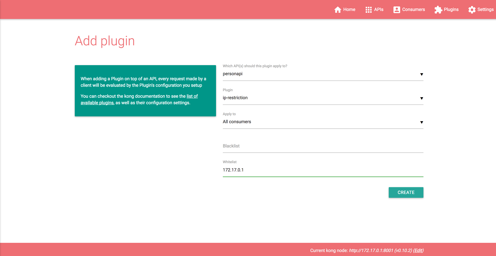

## TRAFFIC CONTROL实现

**user端口添加Rate limiting插件扩展，并设置1分中内只能访问1次**

API：personapi

Minute：1

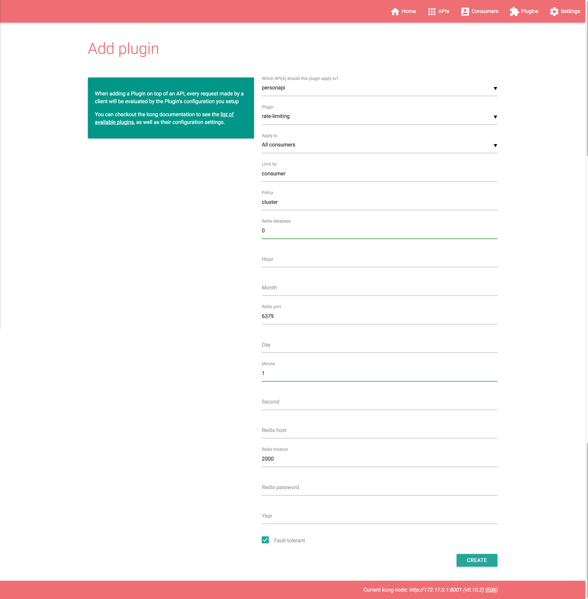

## LOGGING实现

**为user端口添加File-log插件，并设置为日志文件路径设为:/tmp/file.log**

API：personapi

Path：/tmp/file.log

Reopen：YES

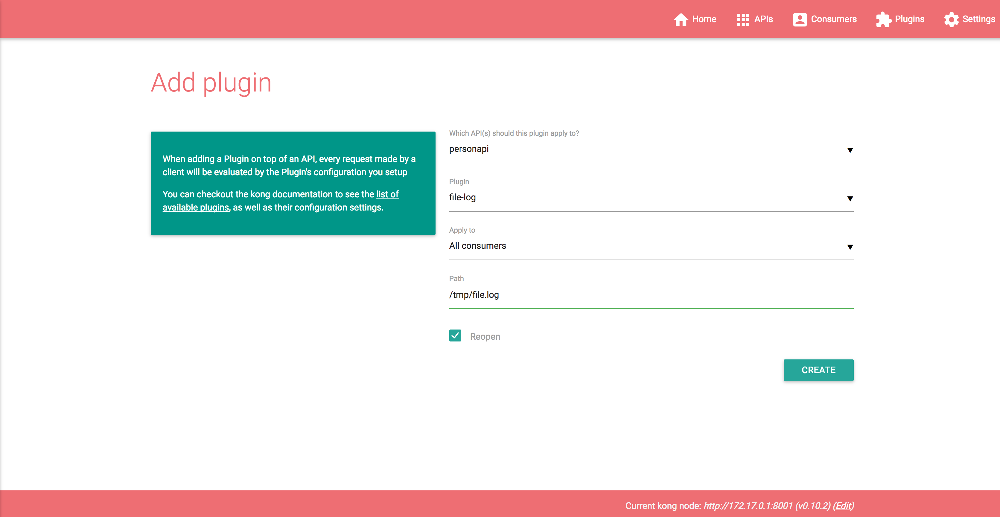

