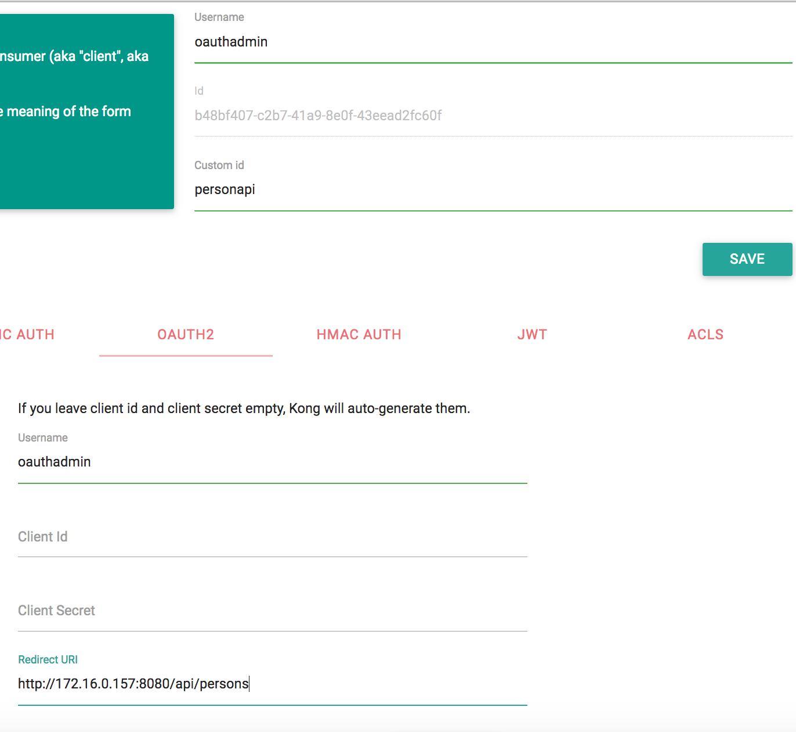
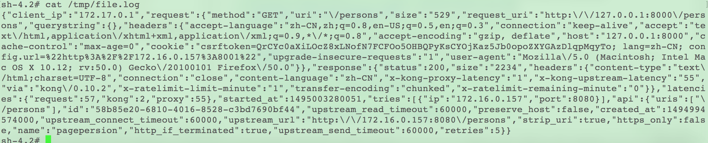

# KONG DASHBOARD方法

## KONG基本使用

### 首次使用

首次访问 http://locaslhost:5000 ，将出现Kong node configuration页面。

图kongforfirsttime

需要我们填写Kong node URL，注意此处应填写 http://172.17.0.1:8001 （docker0 interface ip）或 http://192.168.x.x:8001 (LAN ip) ，否则将显示`can't connect to Kong server`。AUTHENTICATION及Gelato links for consumer选项一般情况下无需配置。

成功后即可进入欢迎页面

图kongwelcome

### 注册API

点击欢迎页面右上角`API`，并在页面中点击`ADD API`，进入API注册页面

图kongaddapi

例如我们想要将user端口注册到kong，只需填写`Name`、`Hosts`、`Upstream uri`三项并点击`CREATE`即可，其他选项无需特意配置或使用默认即可。

添加后可在API页面查看已注册API：

图kongapilist

### 添加用户

点击欢迎页面右上角`Consumers`，并在页面中点击`ADD CONSUMER`，进入用户添加页面填写`Username`及`Custom id`并点击`CREATE`即可完成添加

图kongaddconsumer

我们可以在consumer列表中管理用户，并为用户添加KEY AUTH（可以自己定义key或不填写使用kong自动生成的key）

图kongconsumerkeyauth

### API添加插件

点击欢迎页面右上角`Plugins`，并在页面中点击`ADD PLUGIN`进入API添加插件页面，只需在下拉菜单中选择api及插件，并按照喜好定义key name、Anonymous及credentials是否隐藏即可。

图kongaddplugin

已添加插件可在Plugins列表中查看并随时修改。

图kongpluginsmanage

## ROUTING实现

**注册user端口api**

Name：persons

Hosts：persons

Upstream url：https://172.16.0.127:8080/api/persons

图adduserapi

**注册newinfo端口api**

Name：newinfoapi

Hosts：newinfoapi

Upstream url：upstream_url=https://172.16.0.127:8080/api/newinfos

图addnewinfoapi

**通过Kong代理访问**

user端口：https://127.0.0.1:8080/api/persons

newinfo端口：https://127.0.0.1:8080/api/newinfos

## AUTHENTICATION实现

* 注册Oauth2插件，参见[配置说明](https://getkong.org/plugins/oauth2-authentication/#configuration)。

* 添加Consumer及Consumer对应的credentials

newinfo端口由于数据不敏感，无需特殊配置。

## SECURITY实现

* 为user端口添加IP Restriction插件扩展，并设置白名单（只有名单内的IP可以访问API）。

白名单内IP访问：

其他IP访问：

newinfo端口无需配置此插件。

## TRAFFIC CONTROL实现

* 为user端口添加Rate Limiting插件扩展，设置为1分钟内只能访问1次

正常访问展示:

超出次数的访问展示:

newinfo端口无需配置此插件。

## LOGGING实现

* 为user端口添加File-log插件，并设置为日志文件路径设为:/tmp/file.log

* 添加日志插件后，每次访问都会被记录

newinfo端口无需配置此插件。
