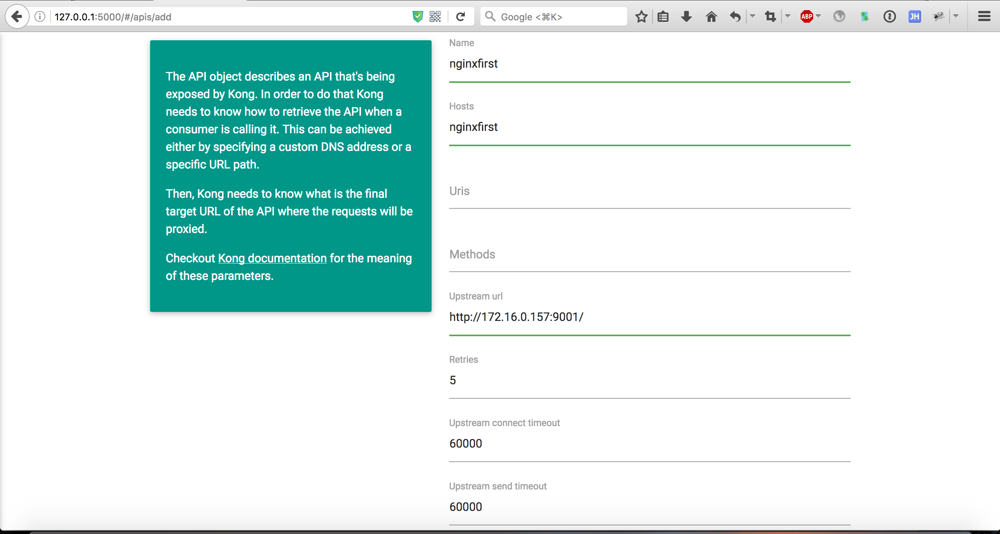

# KONG DASHBOARD方法

### 注册API

使用Kong代理API，首先需要把API注册到Kong，并在在API列表页查看，如下将9001的nginx注册到Kong：

### 添加用户

API可能没有用户概念，可以随意调用。Kong为这种情况提供了一种consumer对象（全局共用），如某API启用了key-auth，没有身份的访问者将无法调用该API。

首先创建一个consumer，然后在key-auth插件中为这个consumer生成一个key，然后就可以使用这个key来透过权限验证访问API了。

需要注意的是：

* 若另一API也开通了key-auth插件，那么这个consumer也是可以通过key-auth验证访问这个API的，想要控制这种情况，需借助Kong的[ACL插件](https://getkong.org/plugins/acl/)

* 对于Kong来讲，认证与权限是两个不同的东西

### API添加插件

如为前面注册的9001nginx添加访问控制，所有通过验证的请求可以访问，而验证失败请求则不能：

## ROUTING实现

* 注册user api

* 注册newinfo api

注册成功后即可通过Kong代理访问用户信息（user端口）、新闻信息（newinfo端口）

此时，可以将用户信息、新闻通知对外访问控制限制为只有Kong可以访问，外部请求全部通过Kong进行代理。

## AUTHENTICATION实现

* 注册Oauth2插件，参见[配置说明](https://getkong.org/plugins/oauth2-authentication/#configuration)。

* 添加Consumer及Consumer对应的credentials

newinfo端口由于数据不敏感，无需特殊配置。

## SECURITY实现

* 为user端口添加IP Restriction插件扩展，并设置白名单（只有名单内的IP可以访问API）。

白名单内IP访问：

其他IP访问：

newinfo端口无需配置此插件。

## TRAFFIC CONTROL实现

* 为user端口添加Rate Limiting插件扩展，设置为1分钟内只能访问1次

正常访问展示:

超出次数的访问展示:

newinfo端口无需配置此插件。

## LOGGING实现

* 为user端口添加File-log插件，并设置为日志文件路径设为:/tmp/file.log

* 添加日志插件后，每次访问都会被记录

newinfo端口无需配置此插件。
